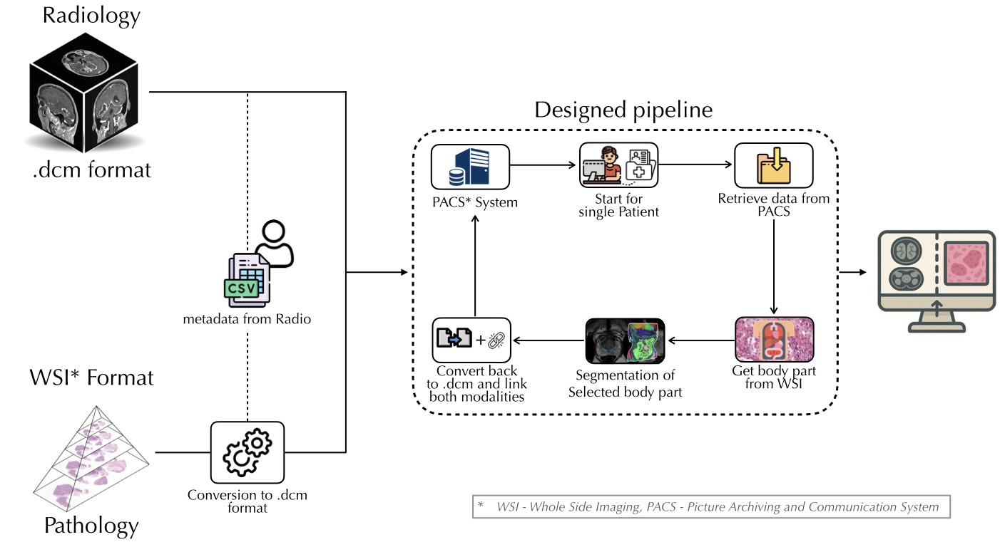

# Bridging Radiology and Pathology
## A DICOM-based Framework for Multimodal Mapping and Integrated Visualization

[](LICENSE.txt)
[](https://doi.org/10.1007/978-3-658-51100-5_62)

> **Rijhwani et al., BVM 2026** — An interdisciplinary toolbox that bridges radiology and pathology imaging within a unified DICOM-based environment, deployable as a standalone tool or as a Kaapana extension.

---

## Demo


---

## Screenshots

.jpg)

---

## Methodological Overview



The framework addresses two fundamental requirements for multimodal image evaluation:

1. **Modality mapping** — Whole slide images (WSIs) are converted to DICOM format using [wsi-dicomizer](https://github.com/imi-bigpicture/wsidicomizer) and spatially linked to their corresponding radiology images by resolving the anatomical region via [TotalSegmentator](https://github.com/wasserth/TotalSegmentator).
2. **Synchronized visualization** — A split-screen web viewer embeds [OHIF](https://ohif.org/) (radiology) and [SLIM](https://github.com/ImagingDataCommons/slim) (pathology) in a single coherent interface, with interactive overlays that link directly to the corresponding pathology slide.

All data is managed through a [dcm4chee](https://www.dcm4che.org/) PACS using standardized DICOM tags, making the pipeline fully reproducible and interoperable with existing medical imaging infrastructures.

---

## Key Features

- **Split-screen viewer** — OHIF (radiology) and SLIM (pathology) unified in a single web interface
- **Automated multimodal mapping** — TotalSegmentator derives organ context from WSIs and segments corresponding structures in radiology volumes
- **DICOM-native** — Both modalities handled through dcm4chee PACS; WSI conversion via wsi-dicomizer
- **Interactive overlays** — Radiology overlays link directly to the matched pathology slide
- **Kaapana integration** — Available as a Kaapana extension with an Airflow-orchestrated auto-segmentation pipeline
- **Standalone deployment** — Can be run independently via Docker Compose without a full Kaapana installation

---

## Repository Structure

```
combinedmodalityviewer/
├── Application_folder/       # Split-screen viewer application (OHIF + SLIM + nginx + dcm4chee)
│   └── SViewer2.0/
│       ├── split-viewer/     # Vite/React wrapper combining both viewers
│       └── Viewers/          # OHIF Viewers fork with DKFZ customizations
├── Docker_Images/            # Pre-built Docker image tarballs and deployment notes
├── Kaapana_Extension/        # Kaapana workflow extension (Helm chart + Airflow DAG)
│   └── Auto-segmentation-pipeline/
│       └── processing-containers/  # TotalSegmentator-based organ segmentation container
├── Readme/                   # Demo video, screenshots, flowchart, and associated paper
├── Report/                   # Full technical report (LaTeX source + compiled PDF)
└── LICENSE.txt
```

---

## Getting Started

Two deployment paths are available: **build from source** (recommended for development) or **use pre-built Docker images** (quickest setup).

---

### Option A — Build from Source

**Requirements:** Docker, Docker Compose, Git

**1. Clone this repository**

```bash
git clone https://github.com/MIC-DKFZ/combinedmodalityviewer.git
cd combinedmodalityviewer
```

**2. Clone and start the SLIM pathology viewer**

The [SLIM viewer](https://github.com/ImagingDataCommons/slim) must be cloned and started separately before the main stack:

```bash
git clone https://github.com/ImagingDataCommons/slim.git
cd slim
docker compose up -d --no-deps app
cd ..
```

**3. Start the main application stack**

Navigate to the Nginx + dcm4chee recipe and bring up all services:

```bash
cd Application_folder/SViewer2.0/Viewers/platform/app/.recipes/Nginx-Dcm4chee
docker compose up
```

This starts the OHIF viewer, split-screen wrapper, split-server, dcm4chee PACS (LDAP + PostgreSQL + archive), and nginx reverse proxy. Once running, open [http://localhost](http://localhost) in your browser.

---

### Option B — Pre-built Docker Images

**Requirements:** Docker, Docker Compose

**1. Download the pre-built image tarball**

Download `nginx-SPLITVIEWER-images.tar` from [hub.dkfz.de/f/108118972](https://hub.dkfz.de/f/108118972) and load it:

```bash
docker load -i nginx-SPLITVIEWER-images.tar
```

**2. Start the application stack**

```bash
cd Application_folder/SViewer2.0/Viewers/platform/app/.recipes/Nginx-Dcm4chee
docker compose up -d
```

Open [http://localhost](http://localhost) in your browser.

> **Note:** The pre-built images are built for x86_64. If you need to migrate existing Postgres or LDAP data, back up and restore the respective Docker volumes before starting.

---

### Kaapana Extension (v0.5.2)

For institutional deployments on a MicroK8s/Kubernetes cluster, the full Kaapana-based platform (including the automated organ-segmentation pipeline) can be deployed via the provided Helm script:

```bash
cd Application_folder/SViewer2.0
bash deploy_platform_0.5.2.sh
```

The script runs preflight checks, pulls the Kaapana admin chart from the HZDR registry, handles version migrations, and installs all platform components.

For detailed architecture, configuration options, and evaluation, see the technical report in [`Report/main.pdf`](Report/main.pdf).

---

## Paper

This work was presented at **Bildverarbeitung für die Medizin (BVM) 2026**:

> Nilesh P. Rijhwani, Titus J. Brinker, Neher Peter, Nolden Marco, Klaus Maier-Hein, Christoph Wies, Maximilian Fischer.
> **Bridging Radiology and Pathology: A DICOM-based Framework for Multimodal Mapping and Integrated Visualization.**
> In: Handels H. et al. (Hrsg.), *Bildverarbeitung für die Medizin 2026*, Informatik aktuell, Springer Fachmedien Wiesbaden, 2026.
> https://doi.org/10.1007/978-3-658-51100-5_62

The paper PDF is included in [`Readme/978-3-658-51100-5_62.pdf`](Readme/978-3-658-51100-5_62.pdf).

---

## Citation

If you use this framework in your research, please cite:

```bibtex
@InProceedings{rijhwani2026bridging,
  author    = {Rijhwani, Nilesh P. and Brinker, Titus J. and Peter, Neher
               and Nolden, Marco and Maier-Hein, Klaus and Wies, Christoph
               and Fischer, Maximilian},
  title     = {Bridging Radiology and Pathology: {A} {DICOM}-based Framework
               for Multimodal Mapping and Integrated Visualization},
  booktitle = {Bildverarbeitung f{\"u}r die Medizin 2026},
  editor    = {Handels, H. and others},
  publisher = {Springer Fachmedien Wiesbaden GmbH},
  year      = {2026},
  doi       = {10.1007/978-3-658-51100-5_62},
}
```

---

## License

Copyright © 2025 Division of Medical Image Computing, German Cancer Research Center (DKFZ), Heidelberg, Germany.

This project is licensed under the **Apache License 2.0** — see [`LICENSE.txt`](LICENSE.txt) for the full text.

### Third-party licenses

This framework integrates several open-source components, each governed by its own license. Users must comply with the individual licenses of all incorporated tools, including but not limited to:

| Component | License |
|-----------|---------|
| [OHIF Viewers](https://github.com/OHIF/Viewers) | MIT |
| [SLIM](https://github.com/ImagingDataCommons/slim) | Apache 2.0 |
| [dcm4chee](https://www.dcm4che.org/) | LGPL 2.1 |
| [TotalSegmentator](https://github.com/wasserth/TotalSegmentator) | Apache 2.0 |
| [wsi-dicomizer](https://github.com/imi-bigpicture/wsidicomizer) | Apache 2.0 |
| [Kaapana](https://github.com/kaapana/kaapana) | Apache 2.0 |

The respective license texts are distributed with each component. By using this software, you agree to abide by all applicable third-party licenses in addition to the Apache 2.0 license of this repository.
